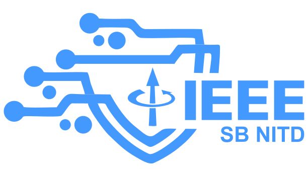

<div align="center">
  
  <h1>VORTEX 2026</h1>
  <p><strong>Flagship Multi-Stage Cyber-Vision & Algorithmic Challenge Platform</strong></p>
  <p><em>Organized by IEEE Student Branch, NIT Durgapur</em></p>

  [](LICENSE)
  [](https://nodejs.org/)
  [](https://reactjs.org/)
  [](https://vitejs.dev/)
  [](https://tailwindcss.com/)
  [](https://firebase.google.com/)
</div>

---

## ⚡ Executive Overview

**VORTEX 2026** is a state-of-the-art, real-time competition portal developed for IEEE Student Branch NIT Durgapur. The platform powers multi-round tech events featuring **Computer Vision grid processing**, **Data Science puzzle engines**, **Detective cipher solving**, and **Real-Time Multiplayer Synchronized Gameplay**.

Built with a modern web architecture, VORTEX 2026 supports live leaderboard tracking, automated Cloudinary image slicing, role-based access control (RBAC), and socket-driven multiplayer game states.

---

## ✨ Key Platform Features

### 🧩 1. Deterministic Image Processing & Puzzle Generator
- **Automatic Image Slicing**: Admins upload any high-resolution image; Sharp + Cloudinary deterministically crop the source image into customizable grid sizes (e.g. 3x3, 4x4).
- **Deterministic Piece Mapping**: Each piece is generated with immutable coordinates, original aspect ratios, and signed Cloudinary URLs.
- **Anti-Cheat Validation**: Server-side layout verification checks exact piece placement vectors.

### 🎮 2. Synchronized Team Gameplay
- **Team Leader Controls**: Only designated Team Leaders can launch game sessions and submit tile arrangements.
- **Live Spectator Mode**: Teammates view game board movements in real-time via Socket.IO events.
- **Shared Timer & Session Persistence**: Round timers sync automatically across connected client instances.

### 🛡️ 3. Administrative Control Console
- **Real-Time Audit Trail**: Logs every administrative action (puzzle creations, score modifications, freeze events).
- **Leaderboard Management**: Manual/automatic leaderboard freeze and publish controls.
- **Team Leadership Management**: Dynamic assignment of team leaders with automatic role promotion/demotion sync.

### 🔐 4. Authentication & Security
- **Firebase OAuth 2.0**: Verified Google sign-in integration.
- **Hybrid Dev Fallback**: Local development auth bypass mode for rapid testing without cloud dependency.
- **JWT HTTP-Only Cookies**: Secure session token persistence.

---

## 🛠️ Technology Stack

| Layer | Technology |
| :--- | :--- |
| **Frontend Framework** | React 18 + Vite |
| **Styling & Aesthetics** | Tailwind CSS v4 + Custom Dark Theme + Glassmorphism |
| **Iconography** | Lucide React |
| **Backend Runtime** | Node.js (ES Modules) + Express.js |
| **Real-Time Engine** | Socket.IO (WebSockets) |
| **Database** | MongoDB Atlas (Mongoose) + Local File Storage Fallback |
| **Media Pipeline** | Cloudinary API + Sharp Node.js |
| **Auth Provider** | Firebase Authentication + JWT |

---

## 📁 Repository Structure

```
ieee_event/
├── client/                     # Frontend Application (React + Vite)
│   ├── public/                 # Static Assets (IEEE Logos, SVGs, Favicons)
│   │   └── ieeesb_logo_theme.svg
│   ├── src/
│   │   ├── components/         # Reusable UI Components & Custom IEEE Loader
│   │   ├── config/             # Firebase & API Client Configuration
│   │   ├── context/            # Global Auth Context & State
│   │   ├── pages/              # Router Page Views (Dashboard, Game, Admin, etc.)
│   │   └── services/           # Socket.IO & Fetch Client Wrappers
│   └── vite.config.js
│
├── server/                     # Backend Application (Node.js Express)
│   ├── src/
│   │   ├── config/             # Database, Firebase Admin & JWT Configs
│   │   ├── middleware/         # Auth & Role-Based Access Control
│   │   ├── models/             # Mongoose Schemas (User, Team, Puzzle, Round, Audit)
│   │   ├── routes/             # RESTful Express Routes
│   │   ├── services/           # Image Processing, Ranking Engine & Store
│   │   └── index.js            # Express Server + Socket.IO Server Entrypoint
│   └── package.json
│
├── AUDIT_REPORT.md             # Security and Quality Audit Record
├── package.json                # Monorepo / Combined Scripts
└── README.md                   # Project Documentation
```

---

## 🚀 Quick Start Guide

### Prerequisites
- **Node.js**: `v18.0.0` or higher
- **npm**: `v9.0.0` or higher
- **MongoDB Atlas Connection** (Optional, includes fallback in-memory store)

### 1. Clone Repository
```bash
git clone https://github.com/kartikeya7609/ieee_event.git
cd ieee_event
```

### 2. Install Dependencies
```bash
# Install root dependencies
npm install

# Install client & server dependencies
cd server && npm install
cd ../client && npm install
cd ..
```

### 3. Environment Setup

#### Server Environment (`server/.env`)
```env
PORT=5000
NODE_ENV=development
CLIENT_URL=http://localhost:5173
JWT_SECRET=your_jwt_secret_key
MONGODB_URI=your_mongodb_connection_string
CLOUDINARY_CLOUD_NAME=your_cloud_name
CLOUDINARY_API_KEY=your_api_key
CLOUDINARY_API_SECRET=your_api_secret
FIREBASE_PROJECT_ID=aarohan-da931
```

#### Client Environment (`client/.env`)
```env
VITE_API_BASE_URL=http://localhost:5000/api/v1
VITE_SOCKET_URL=http://localhost:5000
VITE_FIREBASE_API_KEY=your_firebase_api_key
VITE_FIREBASE_AUTH_DOMAIN=aarohan-da931.firebaseapp.com
VITE_FIREBASE_PROJECT_ID=aarohan-da931
```

### 4. Run Development Servers

```bash
# Run server (from /server directory)
npm run dev

# Run client (from /client directory)
npm run dev
```

Open `http://localhost:5173` in your browser.

---

## 🏆 Round Mechanics

1. **Round 1: Cipher & Computer Vision Grid Puzzle**
   - Teams reconstruct fragmented source images within time constraints.
2. **Round 2: Algorithmic Detective Challenge**
   - Interactive logic and clue solving.
3. **Round 3: Data Science & AI Finales**
   - Live predictive leaderboard challenges.

---

## 📜 License & Accreditation

Organized and managed by **IEEE Student Branch, National Institute of Technology Durgapur**.  
Released under the [MIT License](LICENSE).
